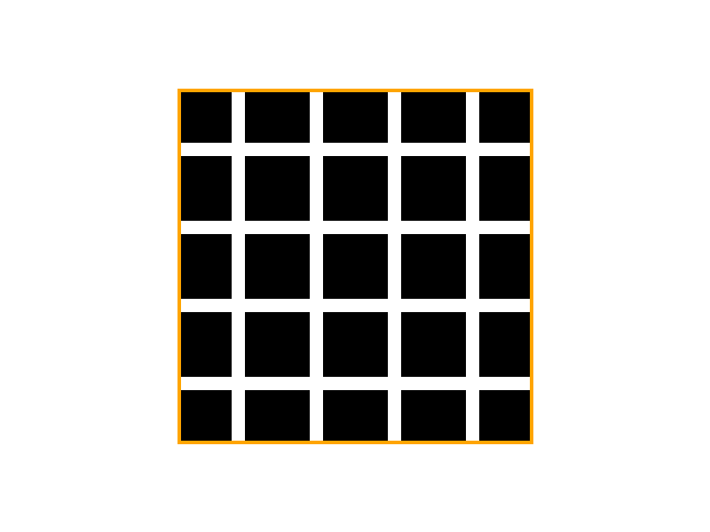
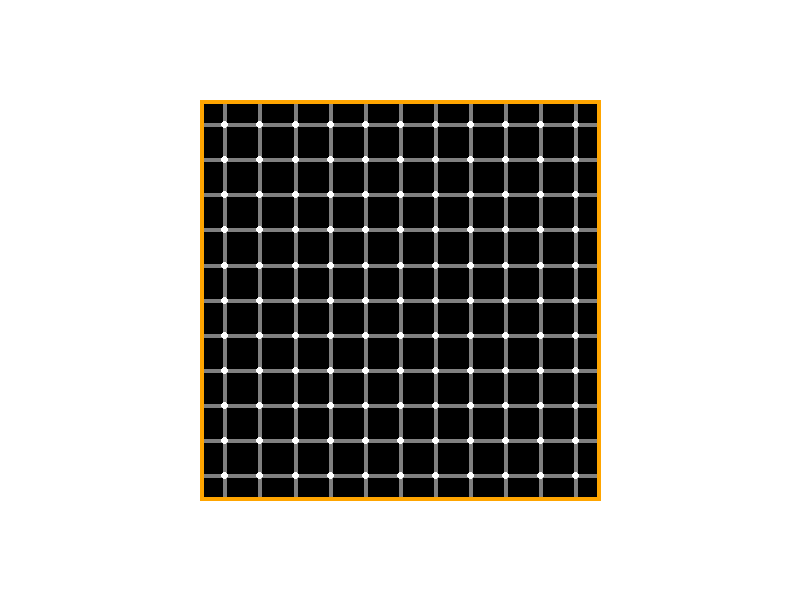
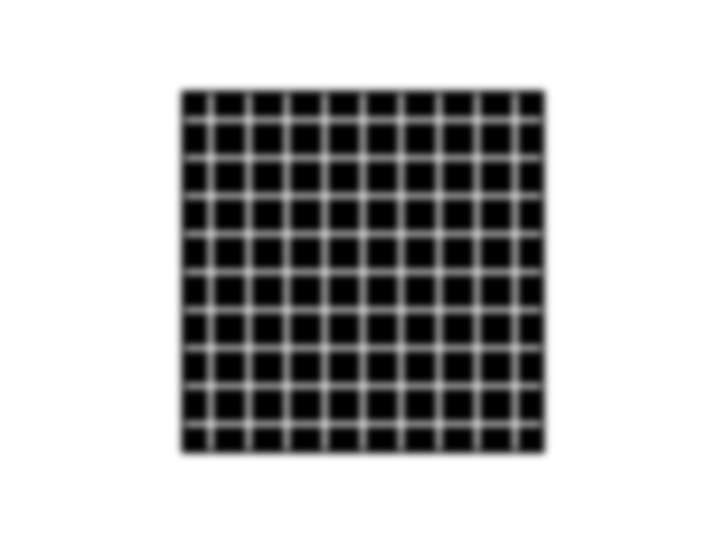

# Grid-Illusions
**A flexible Python package enabling users to draw the Hermann, scintillating, and Bergen grid illusions.**

## Rationale
The purpose of creating this Python package was to provide an easy-to-use tool for developing simple grid illusions, tractable for implementation within psychological paradigms. This is the first package that I am aware of to feature all three grid illusions.

## Illusions included in this package
### Hermann grid illusion
First described in 1870<sup>1</sup>, the Hermann grid illusion is prototypically created when looking at a white grid on top of a black background. The optical illusion experienced consists of deceptively seeing relatively faint dark patches appearing at the intersections of the grid lines.

<figure>
 
</figure>


## Scintillating grid illusion
Created in the 1990s<sup>2</sup>, this illusion 

<figure>
 
</figure>

## Bergen grid illusion
TEXT HERE

<figure>
 
</figure>


## Installation
Install directly from this GitHub repository in Python terminal:

```python
pip install https://github.com/OliverACollins/Grid-Illusions/zipball/main
```

## Parameters
In order to vary the strength of each grid illusion, there are a number of parameters for each illusion that can be set. Examples of these arguments include:
- `cells`: sets the number of cells in the grid (although, this argument will be influenced visually by the `grid_zoom` argument by default)
- `size`: determines the size of the grid illusion (in pixels)
- `grid_zoom`: applies a zoom function to the grid to ensure a more natural grid appearance
- `grid_width`: specifies the width of the grid lines (both vertical and horizontal dimensions)
- `blur_strength`: mostly relevant to the Bergen illusion, this controls the Gaussian blur on the image (set to 0 by default for the Hermann and scintillating illusions)
- `vertical_colour`: change the colour of the vertical grid lines. Here, you can use [HTML colour names](https://www.w3schools.com/tags/ref_colornames.asp) or [HEX codes](https://www.color-hex.com/), ensuring that such HEX codes are inputted as a string
- `horizontal_colour`: change the colour of the vertical grid lines
- `save`: allows one to change the filename (and file path) for the illusion image. It is crucial to specify the file extension (e.g., .png, .jpg, .tiff, .pdf)

## Usage: CLI
To generate each illusion, you can run the following commands in the Python terminal:

```python
grid-illusions hermann
```

```python
grid-illusions scintillating
```

```python
grid-illusions bergen
```

To view the parameters included for each illusion, simply use the `--help` option in the Python terminal, giving a brief description of what each argument does and its default setting:

```python
grid-illusions hermann --help
```

Parameters can be specified in the following manner:

```python
grid-illusions hermann --size 300 --grid_width 8 --vertical_colour blue --horizontal_colour blue
```


## Usage: Python script


## References
<sup>1</sup> Hermann, L. (1870). Eine Erscheinung simultanen Contrastes. Pflüger, Archiv für die Gesammte Physiologie des Menschen und der Thiere, 3(1), 13–15. https://doi.org/10.1007/BF01855743
<br>
<sup>2</sup> Schrauf M, Lingelbach B, Lingelbach E & Wist ER (1995) The Hermann grid and the scintillation effect. Perception 24: suppl, 88–89
<br>
<sup>3</sup>

*If any issues occur with this Python package, please open an [Issue](https://github.com/OliverACollins/Grid-Illusions/issues) so that any problems highlighted can be addressed. Thank you!*