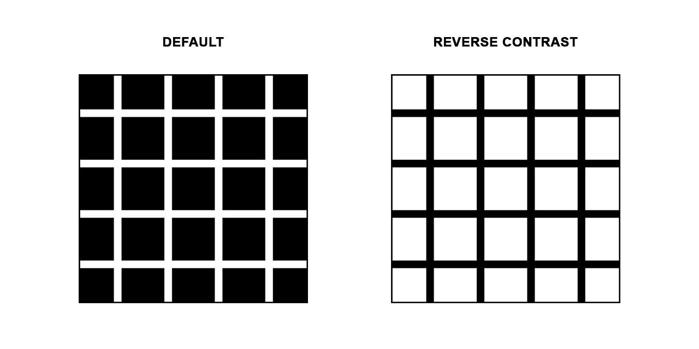
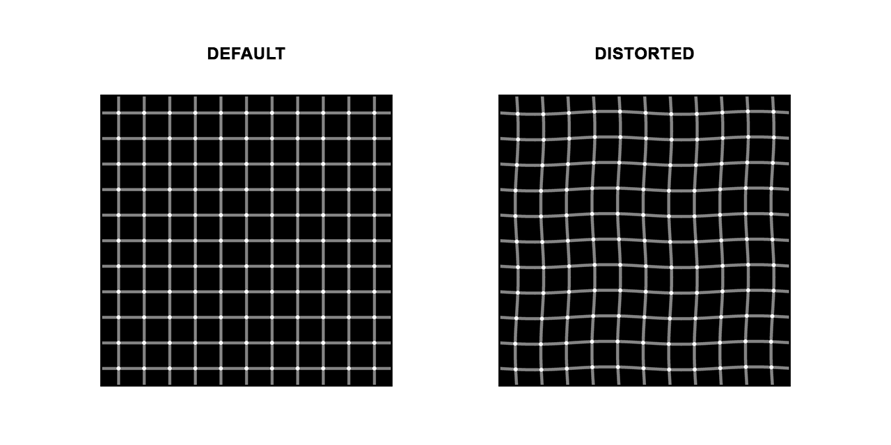

# Grid-Illusions
**A flexible Python package enabling users to draw several different grid illusions.**

## Rationale
The purpose of creating this Python package was to provide an easy-to-use tool for developing simple, customisable grid illusions, tractable for implementation within psychological paradigms. This is the first package that I am aware of to feature all five grid illusions included.

[Try out this demonstration of a simple implementation using this package](LINK HERE)

## Illusions included in this package
### Hermann grid illusion
First described by Brewster in 1844[^1], although generally attributed to Hermann (1870)[^2], the Hermann grid illusion is prototypically created when looking at a white grid on top of a black background. The optical illusion experienced consists of deceptively seeing relatively faint dark patches appearing at the intersections of the grid lines.

<figure>
 
</figure>

## Scintillating grid illusion
Documented in the 1990s[^3], this illusion is commonly generated by placing a grey grid on top of a black background, with white dots positioned at the intersections of the vertical and horizontal grid lines. As one's eyes move around the picture, it appears as though the white dots are twinkling between white and black.

<figure>
 
</figure>

## Bergen grid illusion
TEXT HERE

<figure>
 
</figure>

+ INCLUDE REVERSE CONTRAST BERGEN??

## Ninio's extinction illusion
TEXT HERE - what does "extinction" mean?

<figure>
 
</figure>


## McAnany-Levine's extinction illusion
Creating a particularly powerful effect, the McAnany-Levine extinction illusion 

<figure>
 
</figure>

For this illusion to work as intended, it is recommended that 

## Installation
Install directly from this GitHub repository in Python terminal:

```python
pip install https://github.com/OliverACollins/Grid-Illusions/zipball/main
```

## Parameters
There are a number of parameters that can be set for each grid illusion, such as to vary the <b>strength</b> of an illusion. Examples of these arguments include:
- `cells`: sets the number of cells in the grid (although, this argument will be influenced visually by the `grid_zoom` argument by default)
- `size`: determines the size of the grid illusion (in pixels)
- `grid_zoom`: applies a zoom function to the grid to ensure a more natural grid appearance
- `grid_width`: specifies the width of the grid lines (both vertical and horizontal dimensions)
- `vertical_colour`: change the colour of the vertical grid lines. Here, as with any of the colour arguments, you can use [HTML colour names](https://www.w3schools.com/tags/ref_colornames.asp) or [HEX codes](https://www.color-hex.com/), ensuring that such HEX codes are inputted as a string
- `horizontal_colour`: change the colour of the vertical grid lines
- `wiggle_strength`: the amplitude of the distortion applied to the grid lines
- `wiggle_frequency`: the number of waves in the grid lines when distorted
- `blur_strength`: mostly relevant to the Bergen illusion, this controls the Gaussian blur on the image (set to 0 by default for the Hermann and scintillating illusions)
- `save`: allows one to change the filename (and file path) for the illusion image. It is crucial to specify the file extension (e.g., .png, .jpg, .tiff, .pdf)

Key parameters for adjusting illusion strength include:


## Usage: CLI
To generate each illusion, you can run the following commands in the Python terminal:

```python
grid-illusions hermann
```

```python
grid-illusions scintillating
```

```python
grid-illusions bergen
```

```python
grid-illusions ninio
```

```python
grid-illusions mcanany-levine
```

To view the parameters included for each illusion, simply use the `--help` option in the Python terminal to read a brief description of what each argument does and its default setting:

```python
grid-illusions hermann --help
```

Parameters can be specified in the following manner:

```python
grid-illusions hermann --size 300 --grid_width 8 --vertical_colour blue --horizontal_colour blue
```

## Usage: Python script
As well as using the CLI to generate grid illusions, users can also achieve this within their Python script, which is likely more convenient when creating psychological paradigms. The arguments for each illusion can be specified within one's Python script. For example:

```python
from grid_illusions.hermann import draw_hermann

img = draw_hermann(
    side=300,
    grid_width=8,
    vertical_colour="blue",
    horizontal_colour="blue"
)

img.show()
img.save("hermann.png")
```

*If any issues occur with this Python package, please open an [Issue](https://github.com/OliverACollins/Grid-Illusions/issues) so that any problems highlighted can be addressed. Thank you!*

## References
[^1]: Brewster, D., 1844. 'A notice explaining the cause of an optical phenomenon observed by the Rev. W. Selwyn', Report of the British Association for the Advancement of Science, Transactions of the Sections, p.8.

[^2]: Hermann, L. (1870). Eine Erscheinung simultanen Contrastes. Pflüger, Archiv für die Gesammte Physiologie des Menschen und der Thiere, 3(1), 13–15. https://doi.org/10.1007/BF01855743

[^3]: Schrauf M, Lingelbach B, Lingelbach E & Wist ER (1995) The Hermann grid and the scintillation effect. Perception 24: suppl, 88–89